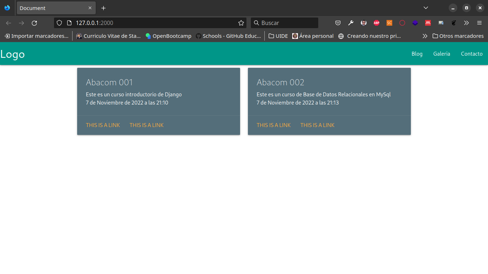

# Ejemplo de Proyecto en Django Framwork 3.2

-   Paso 1

Clonar el repositorio.

```{bash}
git clone https://github.com/5t4t1ck/ejemplo_cursos_django.git
```

-   Paso 2

Crear el entorno virtual.

```{bash}
python -m venv env
```

-   Paso 3

Activar el entorno virtual.

```{bash}
cd env/Scripts
activate
cd ..
cd ..
```

-   Paso 4

Instalar todas las dependencias el proyecto.

```{bash}
pip install -r requirements.txt
```

-   Paso 5

Crear el super usuario

```{bash}
python manage.py createsuperuser
```

-   Paso 6

Preparar las Migraciones.

```{bash}
python manage.py makemigrations
```

-   Paso 7

Realizar las migraciones.

```{bash}
python manage.py migrate
```

-   Paso 8

Correr el Servidor.

```{bash}
python manage.py runserver
```


